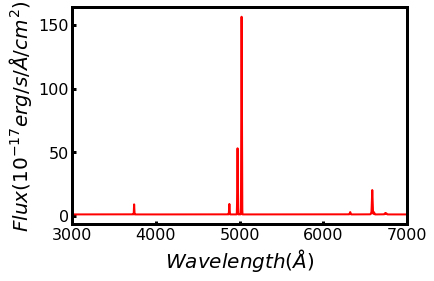
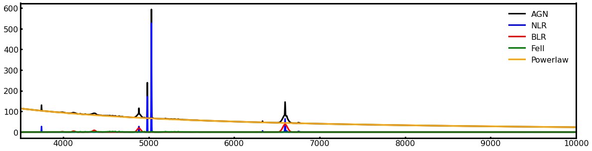

Example
=======

Model A Spectra of AGN
----------------------

**Spectra Components**

* Narrow line region
* Broad line region
* Power law
* FeII emission lines

Spectra of narrow line region
~~~~~~~~~~~~~~~~~~~~~~~~~~~~~

First, preparing the class of emission line templates.

.. code-block:: python

    import csst-ifs-gehong.spec1d as s
    nlr_tem = s.EmissionLineTemplate(flux_table = 'nlr')

Second, model the spectra of narrow line region. 

.. code-block:: Python

    wave = np.linspace(3000, 7000, 10000)
    nl = s.AGN_NLR(wave, nlr_tem, Halpha = 100, logZ = 0, vdisp = 200, vel = 1e3)
    
    plt.plot(nl.wave,nl.flux+1,lw=2,color='red')
    plt.xlim(3000,7000)
    plt.xlabel(r'$Wavelength(\AA)$')
    plt.ylabel(r'$Flux(erg/s/\AA/cm^2)$')
    plt.show()

Spectra of broad line region
~~~~~~~~~~~~~~~~~~~~~~~~~~~~

.. code-block:: Python

    wave = np.linspace(3000, 7000, 10000)
    bl = s.AGN_BLR(wave, Hbeta_Flux = 1000, Hbeta_FWHM = 3000, vel = 1506)

Spectra of FeII Emission Lines
~~~~~~~~~~~~~~~~~~~~~~~~~~~~~~

.. code-block:: Python

    wave = np.linspace(3000, 7000, 10000)
    FeII = s.AGN_FeII(wave, Hbeta_Broad = 1000, vel = 1506)

Spectra of Power Law
~~~~~~~~~~~~~~~~~~~~

.. code-block:: python

    wave = np.linspace(3000, 7000, 10000)
    pl = s.AGN_Powerlaw(wave, M5100 = BHmass_to_M5100(5e5), vel = 1506)

Spectra of AGN
~~~~~~~~~~~~~~

.. code-block:: python

    AGN_flux = nl.flux + bl.flux + pl.flux + FeII.flux
    plt.figure(figsize=(20,5))
    plt.plot(wave, AGN_flux, color='black',label='AGN')
    plt.plot(wave, nl.flux, color='blue',label='NLR')
    plt.plot(wave, bl.flux, color='red',label='BLR')
    plt.plot(wave, FeII.flux, color='green',label='FeII')
    plt.plot(wave, pl.flux, color='orange',label='Powerlaw')
    plt.xlim(3500,10000)
    plt.legend()
    plt.show()

