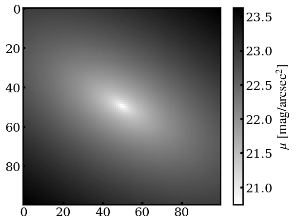
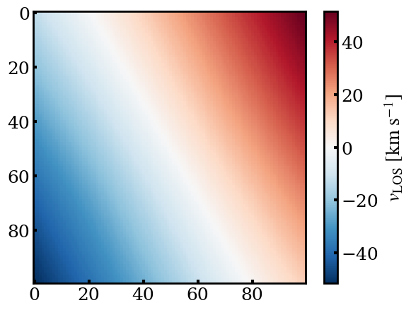
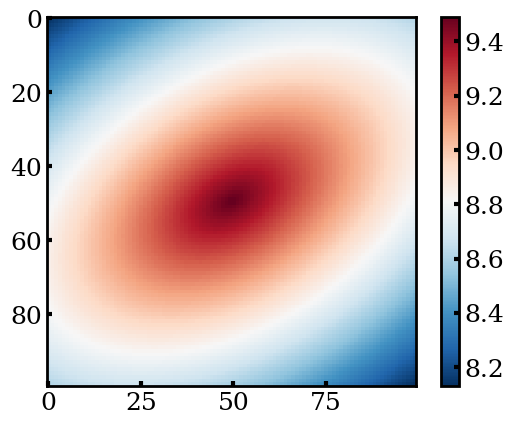

.. _2d-image-simulation:

Two - Dimensional Image Simulation
=====================================

This simulation is implemented by the ``map2d`` module.

Initialization of Two - Dimensional Images
----------------------------------------------

In the ``gehong`` package, all two-dimensional distributions are passed in the form of a class based 
on ``map2d.Map2d()``. Therefore, it is necessary to initialize it before simulating a two-dimensional distribution.

**Main Input Parameters**:

- Simulation data configuration class: ``config``

**Usage Example**:

To simulate a surface brightness distribution, you need to create a class for this two-dimensional distribution first. 
For example:

.. code-block:: python

    from gehong import map2d
    sbmap = map2d.Map2d(config)

Non-Parameterized Two-Dimensional Distributions
-----------------------------------------------

The ``gehong`` package allows you to directly import existing two-dimensional distributions of 
physical parameters (such as observational results and numerical simulation results) into the ``Map2d`` class.

For example, if you know the velocity field ``vmap`` of a galaxy, which is in the form of a two-dimensional array as follows:

.. code-block:: python

    [
        [-60.10162265, -59.73061567, -59.35098406,..., -5.27919182, -4.79226447, -4.31059388],
        [-59.57527736, -59.20481535, -58.82573166,..., -4.756253, -4.26990175, -3.78884127],
        [-59.0411374, -58.67117677, -58.29259928,..., -4.2276208, -3.74189254, -3.26148904],
       ...,
        [3.26148904, 3.74189254, 4.2276208,..., 58.29259928, 58.67117677, 59.0411374],
        [3.78884127, 4.26990175, 4.756253,..., 58.82573166, 59.20481535, 59.57527736],
        [4.31059388, 4.79226447, 5.27919182,..., 59.35098406, 59.73061567, 60.10162265]
    ]

You can import the above two-dimensional array using the ``.loadmap()`` method of the ``Map2d`` class. For example:

.. code-block:: python

    velmap = map2d.Map(config)
    velmap.loadmap(vmap)

The imported two-dimensional distribution is stored in the attribute ``.map``. You can check it like this:

.. code-block:: python

    print(velmap.map)

    [
        [-60.10162265, -59.73061567, -59.35098406,..., -5.27919182, -4.79226447, -4.31059388],
        [-59.57527736, -59.20481535, -58.82573166,..., -4.756253, -4.26990175, -3.78884127],
        [-59.0411374, -58.67117677, -58.29259928,..., -4.2276208, -3.74189254, -3.26148904],
       ...,
        [3.26148904, 3.74189254, 4.2276208,..., 58.29259928, 58.67117677, 59.0411374],
        [3.78884127, 4.26990175, 4.756253,..., 58.82573166, 59.20481535, 59.57527736],
        [4.31059388, 4.79226447, 5.27919182,..., 59.35098406, 59.73061567, 60.10162265]
    ]

Sersic Model
----------------

The method ``.sersic_map()`` of the ``Map2d`` class can be used to simulate a two-dimensional surface brightness 
distribution of the Sersic model.

**Input Parameters**:

- ``mag``: Integrated magnitude of the Sersic model, Unit: :math:`\text{mag}`, Range: 8 mag to 26 mag.
- ``r_eff``: Effective radius, Unit: :math:`\text{arcsec}`, Range: greater than 0 arcsec.
- ``n``: Sersic index, Unit: None. Parameter range: greater than 0.
- ``ellip``: Ellipticity. Unit: None. Parameter range: 0 <= ellip < 1.
- ``theta``: Position angle. Unit: :math:`\text{degree}`, Parameter range: - 180° to 180°.

**Attributes**:
- ``.map``: Simulated two - dimensional distribution, Unit: :math:`\text{mag/arcsec}^2`.

**Usage Example**:

.. code-block:: python

    sbmap.sersic_map(mag = 15.0, r_eff = 4.0, n = 1.0, ellip = 0.2, theta = - 30)

This code will simulate a two - dimensional Sersic distribution with a total magnitude of :math:`15 \text{mag}`, 
an effective radius of :math:`4.0\text{arcsec}`, a Sersic index of 1, an ellipticity of 0.2, and a position angle 
of :math:`- 30\text{degree}$`.

The simulated two - dimensional distribution is as follows:

Tanh Velocity Field Model
------------------------------

The method ``.tanh_map()`` of the ``Map2d`` class can be used to simulate a velocity field where 
the rotation curve is based on the tanh function.

**Input Parameters**:

- ``vmax``: Maximum rotation velocity, Unit: :math:`\text{km/s}`. Parameter range: > 0 :math:`\text{km}\ \text{s}^{-1}`.
- ``rt``: Turnover radius of the rotation curve. Unit: :math:`\text{arcsec}`. Parameter range: > 0 arcsec.
- ``ellip``: Ellipticity. Unit: None. Parameter range: 0 <= ellip < 1.
- ``theta``: Position angle. Unit: :math:`\text{degree}`, Parameter range: - 180° to 180°.

**Attributes**:

- ``.map``: Simulated two - dimensional distribution. Unit: :math:`\text{km/s}`.

**Usage Example**

.. code-block:: python

    velmap = map2d.Map2d(config)
    velmap.tanh_map(vmax=160, rt=2.0, ellip=0.5, theta=30)

This code will simulate a velocity field with a maximum rotation velocity of :math:`160 \text{km/s}`, 
a turnover radius of the rotation curve of :math:`2.0\text{arcsec}`, an ellipticity of :math:`0.5`, and 
a position angle of :math:`30\text{degree}`.

The simulated two - dimensional distribution is as follows:

Two - Dimensional Gradient Model
~~~~~~~~~~~~~~~~~~~~~~~~~~~~~~~~~

The method ``.gred_map()`` of the ``Map2d`` class can be used to simulate a two - dimensional distribution 
based on a gradient model.

**Input Parameters**:

- ``a0``: Central intensity. Unitless, with no specific parameter range.
- ``r_eff``: Effective radius. Unit: :math:`\text{arcsec}`, and the parameter range is greater than 0 arcsec.
- ``gred``: Gradient. Unit: :math:`\text{arcsec}^{-1}`, with no specific parameter range.
- ``ellip``: Ellipticity. Unit: None. Parameter range: 0 <= ellip < 1.
- ``theta``: Position angle. Unit: :math:`\text{degree}`, Parameter range: - 180° to 180°.

**Attributes**:

- Simulated two - dimensional distribution (``.map``): Unitless.

**Usage Example**:

.. code-block:: python

    agemap = m.Map2d(config)
    agemap.gred_map(a0 = 9.5, r_eff = 1, gred = -1.2, ellip = 0.4, theta = 30)

This code will simulate a two - dimensional distribution with a central intensity of :math:`9.5`, an effective radius of :math:`1.0\text{arcsec}`, a gradient of :math:`-1.2`, an ellipticity of :math:`0.4`, and a position angle of :math:`30\text{degree}`.

The simulated two - dimensional distribution is as follows:

