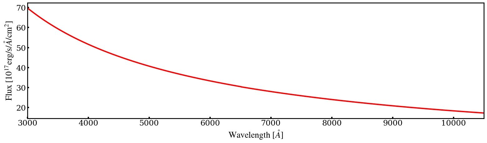
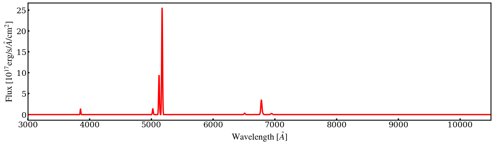
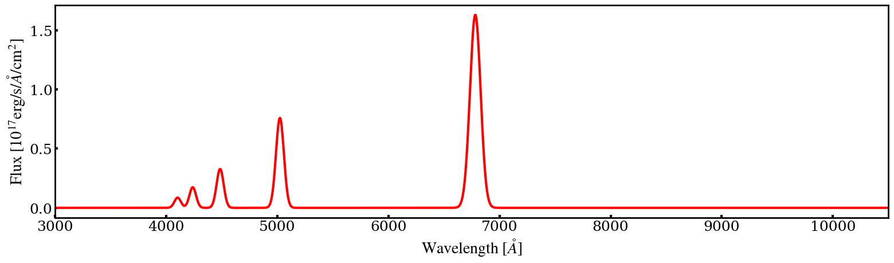
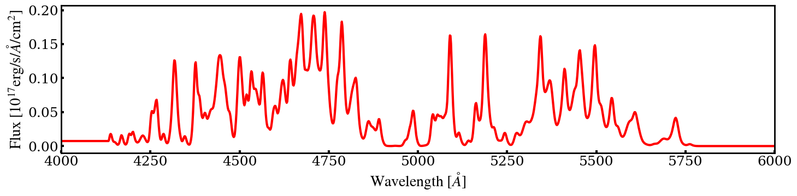
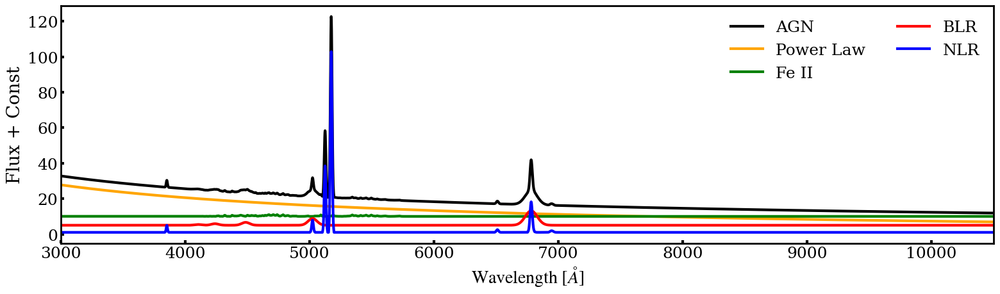
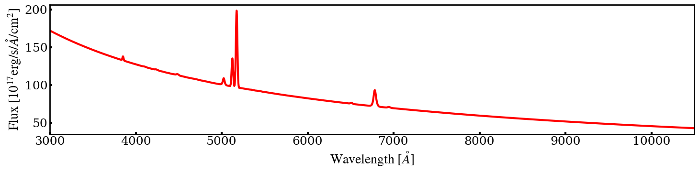

.. _one-dimensional-spectrum-simulation:

Mocking One-Dimentional Spetrum
========================================

This functionality is implemented by the ``spec1d`` module.

Stellar Population Continuum
--------------------------------

Stellar Population Templates
~~~~~~~~~~~~~~~~~~~~~~~~~~~~~~~~~~

The simulation of the stellar continuum spectrum relies on stellar population templates. 
Thus, these templates need to be imported before conducting the simulation. 
The class ``spec1d.StellarContinuumTemplate`` is used to configure the stellar population templates. 
In the current version, this module employs the single - stellar - population templates from ``emiles``.

**Main Input Parameters**:

- Simulation configuration class: ``config``

**Usage Example**:

.. code-block:: python

    from gehong import spec1d
    stellar_tem = spec1d.StellarContinuumTemplate(config)

Stellar Population Spectrum Simulation
~~~~~~~~~~~~~~~~~~~~~~~~~~~~~~~~~~~~~~~~~~~~

The simulation of the stellar continuum spectrum is realized through the class ``spec1d.StellarContinuum``.

**Main Input Parameters**:

- ``mag``: SDSS-:math:`r` band magnitude. Units: :math:`\text{mag}`, parameter range is 8 mag to 26 mag.
- ``age``: Average age of the stellar population. Units: :math:`\text{Gyr}`, parameter range is 0.06 Gyr to 17.8 Gyr.
- ``feh``: Average metallicity of the stellar population. Units: :math:`\text{dex}`, parameter range is - 2.32 to 0.22.
- ``vel``: Line-of-sight velocity. Units: :math:`\text{km s}^{-1}`, no specific parameter range.
- ``vdisp``: Line-of-sight velocity dispersion. Units: :math:`\text{km s}^{-1}`, parameter range is greater than 0 km/s.
- ``ebv``: Dust extinction. Units: :math:`\text{mag}`, parameter range is greater than or equal to 0 mag.

**Attributes**:

- Wavelength of the stellar population spectrum (``.wave``): Unit is :math:`\text{\AA}`.
- Flux of the stellar population spectrum (``.flux``): Unit is :math:`10^{-17} \text{erg/s/\AA/cm}^2`.

**Usage Example**:

.. code-block:: python

    stellar = spec1d.StellarContinuum(config, stellar_tem, mag=17, age=2, feh=-0.3, vel=30000, vdisp=150, ebv=0.2)

This code will simulate a stellar population continuum spectrum with an apparent magnitude of 17 mag, 
an average stellar population age of 2 Gyr, a metallicity of [Fe/H] = - 0.3, a line - of - sight velocity of 
30000 km/s, a velocity dispersion of 150 km/s, and a dust extinction of 0.2 mag. The simulated spectrum is as follows:

.. image:: ../../image/example_spec1d_ssp.png

Ionized Gas Emission Line Simulation
----------------------------------------

Ionized Gas Emission Line Templates
~~~~~~~~~~~~~~~~~~~~~~~~~~~~~~~~~~~~~~~~~

The class ``spec1d.EmissionLineTemplate`` is used to configure the templates for ionized gas emission lines. 
A single emission line is simulated using a Gaussian model.

**Main Input Parameters**:

- Simulation configuration class: ``config``
- Emission line template (``model``): In the current version, there are two types of emission line templates: HII region template (``model = 'hii'``) and AGN narrow - line region template (``model = 'nlr'``).

**Usage Example**:

.. code-block:: python

    gas_tem = spec1d.EmissionLineTemplate(config, model = 'hii')

Ionized Gas Emission Line Simulation
~~~~~~~~~~~~~~~~~~~~~~~~~~~~~~~~~~~~~~~~~~

The class ``spec1d.HII_Region`` is used to simulate the emission line spectrum of the HII region. 
The unit of the finally simulated spectral flux (``.flux``) is :math:`10^{-17} \text{erg/s/\AA/cm}^2`.

**Main Input Parameters**:

- Integrated flux of the :math:`\text{H}\alpha` emission line (``halpha``): Unit is :math:`10^{-17} \text{erg/s/cm}^2`, no specific parameter range.
- Gas - phase metallicity (``logz``): Unit is :math:`\text{dex}`, parameter range is - 2 to 0.5.
- Line - of - sight velocity (``vel``): Unit is :math:`\text{km s}^{-1}`, no specific parameter range.
- Line - of - sight velocity dispersion (``vdisp``): Unit is :math:`\text{km s}^{-1}`, parameter range is greater than 0 km/s.
- Dust extinction (``ebv``): Unit is :math:`\text{mag}`, parameter range is greater than or equal to 0 mag.

**Attributes**:

- Wavelength of the ionized gas emission line (``.wave``): Unit is :math:`\text{\AA}`.
- Flux of the ionized gas emission line (``.flux``): Unit is :math:`10^{-17} \text{erg/s/\AA/cm}^2`.

**Usage Example**:

.. code-block:: python

    gas = spec1d.HII_Region(config, gas_tem, halpha=500, logz=-0.2, vel=30000, vdisp=150, ebv=0.2)

This code will simulate an ionized gas emission line with an :math:`\text{H}\alpha` flux 
of :math:`500 \times 10^{-17} \text{erg/s/cm}^2`, a gas - phase metallicity of :math:`\log \text{Z/Z}_\odot=-0.3`, 
a line - of - sight velocity of 30000 km/s, a velocity dispersion of 150 km/s, and a dust extinction of 0.2 mag. 
The simulated spectrum is as follows:

.. image:: ../../image/example_spec1d_hii.png

Single - Star Spectrum Simulation
-------------------------------------

[Details about single - star spectrum simulation can be added here if available.]

Active Galactic Nucleus Spectrum Simulation
-----------------------------------------------

The spectrum of an active galactic nucleus consists of four components: the narrow-line region spectrum, 
the broad-line region spectrum, the iron - line spectrum, and the power - law spectrum. 
These four component spectra can be simulated either separately or together.

Power-Law Spectrum Simulation
~~~~~~~~~~~~~~~~~~~~~~~~~~~~~~~~~~~~~

The simulation of the power - law spectrum in an AGN is implemented through the class ``spec1d.AGN_Powerlaw``.

**Main Input Parameters**:

- Magnitude at 5100 Å (``m5100``): Unit is :math:`\text{mag}`, no specific parameter range.
- Power - law spectral index (``alpha``): Unit is :math:`\text{dex}`, no specific parameter range.
- Line - of - sight velocity (``vel``): Unit is :math:`\text{km s}^{-1}`, no specific parameter range.
- Dust extinction (``ebv``): Unit is :math:`\text{mag}`, parameter range is greater than or equal to 0 mag.

**Attributes**:

- Wavelength of the AGN power - law spectrum (``.wave``): Unit is :math:`\text{\AA}`.
- Flux of the AGN power - law spectrum (``.flux``): Unit is :math:`10^{-17} \text{erg/s/\AA/cm}^2`.

**Usage Example**:

.. code-block:: python

    pl = spec1d.AGN_Powerlaw(config, m5100=17, alpha=-1.5, vel=10000, ebv=0.1)

This code will simulate an AGN power - law spectrum with a magnitude of 17 mag at 5100 Å, 
a power - law spectral index of - 1.5, a line - of - sight velocity of 10000 km/s, and 
a dust extinction of 0.1 mag. The simulated spectrum is as follows:

Narrow - Line Region Gas Emission Line Simulation
~~~~~~~~~~~~~~~~~~~~~~~~~~~~~~~~~~~~~~~~~~~~~~~~~~~~~~~

Narrow - Line Region Gas Emission Line Templates
^^^^^^^^^^^^^^^^^^^^^^^^^^^^^^^^^^^^^^^^^^^^^^^^^^^^^^^^

Similar to the HII region spectrum simulation, first, the class ``spec1d.EmissionLineTemplate`` is used to configure the templates for ionized gas emission lines. The model should be selected as the AGN narrow - line region template (``model = 'nlr'``).

**Main Input Parameters**:

- Simulation configuration class: ``config``
- Emission line template (``model``): In the current version, there are two types of emission line templates: HII region template (``model = 'hii'``) and AGN narrow - line region template (``model = 'nlr'``).

**Usage Example**:

.. code-block:: python

    nlr_temp = spec1d.EmissionLineTemplate(config, model='nlr')

Narrow-Line Region Gas Emission Line Simulation
^^^^^^^^^^^^^^^^^^^^^^^^^^^^^^^^^^^^^^^^^^^^^^^^^^^^^^^^^

The simulation of the narrow - line region emission line spectrum is achieved through the class ``spec1d.AGN_NLR``.

**Main Input Parameters**:

- Simulation data configuration class: ``config``
- Narrow emission line template class: ``nlr_temp``
- Integrated flux of the :math:`\text{H}\alpha` narrow emission line (``halpha``): Unit is :math:`10^{-17} \text{erg/s/cm}^2`, no specific parameter range.
- Gas - phase metallicity (``logz``): Unit is :math:`\text{dex}`, parameter range is - 2.3 to 0.54.
- Line - of - sight velocity (``vel``): Unit is :math:`\text{km s}^{-1}`, no specific parameter range.
- Line - of - sight velocity dispersion (``vdisp``): Unit is :math:`\text{km s}^{-1}`, parameter range is greater than 0 km/s.
- Dust extinction (``ebv``): Unit is :math:`\text{mag}`, parameter range is greater than or equal to 0 mag.

**Attributes**:

- Wavelength of the AGN narrow emission line spectrum (``.wave``): Unit is :math:`\text{\AA}`.
- Flux of the AGN narrow emission line spectrum (``.flux``): Unit is :math:`10^{-17} \text{erg/s/\AA/cm}^2`.

**Usage Example**:

.. code-block:: python

    nlr = spec1d.AGN_NLR(config, nlr_temp, halpha=100, logz=0, vel=10000, vdisp=400, ebv=0

This code will simulate an ionized gas emission line with an :math:`\text{H}\alpha` narrow emission line 
flux of :math:`100 \times 10^{-17} \text{erg/s/cm}^2`, a gas - phase metallicity of :math:`\log \text{Z/Z}_\odot = 0`, 
a line - of - sight velocity of :math:`10000\text{km/s}`, a velocity dispersion of :math:`400\text{km/s}`, 
and a dust extinction of :math:`0.1\text{mag}`.

The simulated spectrum is as follows:

Broad - Line Region Gas Emission Line Simulation
^^^^^^^^^^^^^^^^^^^^^^^^^^^^^^^^^^^^^^^^^^^^^^^^^^^^^^^^^

The simulation of the broad - line region emission line spectrum is implemented through the class ``spec1d.AGN_BLR``.

**Main Input Parameters**

- Simulation data configuration class: ``config``
- Narrow emission line template class: ``nlr_temp``
- Integrated flux of the :math:`\text{H}\beta` broad emission line (``hbeta_flux``): Unit: :math:`10^{-17} \text{erg/s/cm}^2`, no specific parameter range.
- Full - width at half - maximum of the :math:`\text{H}\beta` broad emission line (``hbeta_fwhm``): Unit: :math:`\text{km s}^{-1}`, parameter range: > 0 km/s.
- Line - of - sight velocity (``vel``): Unit: :math:`\text{km s}^{-1}`, no specific parameter range.
- Dust extinction (``ebv``): Unit: :math:`\text{mag}`, parameter range: ≥ 0 mag.

**Attributes**

- Wavelength of the AGN broad emission line spectrum (``.wave``): Unit is :math:`\text{\AA}`.
- Flux of the AGN broad emission line spectrum (``.flux``): Unit is :math:`10^{-17} \text{erg/s/\AA/cm}^2`.

**Usage Example**

.. code-block:: python

    blr = spec1d.AGN_BLR(config, hbeta_flux=100.0, hbeta_fwhm=5000.0, vel=10000, ebv=0.1)

This code will simulate an AGN broad emission line spectrum with an :math:`\text{H}\beta` broad emission line 
flux of :math:`100 \times 10^{-17} \text{erg/s/cm}^2`, a full - width at half - maximum of the :math:`\text{H}\beta` 
broad emission line of :math:`500\text{km/s}`, a line - of - sight velocity of :math:`10000\text{km/s}`, 
and a dust extinction of :math:`0.1\text{mag}`.

The simulated spectrum is as follows:

Iron Emission Line Spectrum Simulation
^^^^^^^^^^^^^^^^^^^^^^^^^^^^^^^^^^^^^^^^^^^^^^^

The simulation of the iron - line emission in AGN is implemented through the class ``spec1d.AGN_FeII``.

**Main Input Parameters**

- Simulation data configuration class: ``config``
- Integrated flux of the :math:`\text{H}\beta` broad emission line (``hbeta_broad``): Unit: :math:`10^{-17} \text{erg/s/cm}^2`, no specific parameter range.
- Ratio of the :math:`\text{H}\beta` broad emission line flux to the :math:`\text{Fe}4750` emission line flux (``r4750``): Unit: none, no specific parameter range.
- Line - of - sight velocity (``vel``): Unit: :math:`\text{km s}^{-1}`, no specific parameter range.
- Dust extinction (``ebv``): Unit: :math:`\text{mag}`, parameter range: ≥ 0 mag.

**Attributes**

- Wavelength of the AGN iron emission line spectrum (``.wave``): Unit is :math:`\text{\AA}`.
- Flux of the AGN iron emission line spectrum (``.flux``): Unit is :math:`10^{-17} \text{erg/s/\AA/cm}^2`.

**Usage Example**

.. code-block:: python

    fe = spec1d.AGN_FeII(config, hbeta_broad=100.0, r4570=0.4, vel=10000.0, ebv=0.1)

This code will simulate an AGN iron emission line spectrum with an :math:`\text{H}\beta` broad emission line 
flux of :math:`100 \times 10^{-17} \text{erg/s/cm}^2`, a ratio of the :math:`\text{H}\beta` broad emission 
line flux to the :math:`\text{Fe}4750` emission line flux of :math:`0.4`, a line - of - sight velocity of 
:math:`10000\text{km/s}`, and a dust extinction of :math:`0.1\text{mag}`.

The simulated spectrum is as follows:

Synthesis of AGN Total Spectrum
^^^^^^^^^^^^^^^^^^^^^^^^^^^^^^^^^^^^^^^^^^^^^^^

The simulation of the AGN spectrum can be achieved by simulating the above four components separately 
and then superimposing them. As shown below:

.. code-block:: python

    pl = spec1d.AGN_Powerlaw(config, m5100 = 18, alpha = -1.5, vel = 10000, ebv = 0.1)
    nlr = spec1d.AGN_NLR(config, nlr_temp, halpha = 500, logz = -0.3, vel = 10000, vdisp = 400, ebv = 0.1)
    blr = spec1d.AGN_BLR(config, hbeta_flux = 500, hbeta_fwhm = 5000.0, vel = 10000, ebv = 0.1)
    fe = spec1d.AGN_FeII(config, hbeta_broad = 500.0, r4570 = 0.4, ebv = 0.1, vel = 10000)

Superimpose the fluxes of the four components:

.. code-block:: python

    flux = pl.flux + nlr.flux + blr.flux + fe.flux

Then, the black AGN spectrum in the following figure is obtained. The four components are represented by 
the orange line (power - law spectrum), the blue line (narrow emission line), the red line (broad emission line), 
and the green line (iron emission line) in the figure respectively.

Simulation of AGN Total Spectrum
^^^^^^^^^^^^^^^^^^^^^^^^^^^^^^^^^^^^^^^^^^^^^^^

The AGN spectrum can also be simulated directly through the class ``spec1d.AGN`` with all four components.

**Main Input Parameters**

- Simulation data configuration class: ``config``
- Narrow emission line template class: ``nlr_temp``
- Black hole mass (``bhmass``): Unit: :math:`\text{M}_\odot`, parameter range: ≥ 0.
- Eddington ratio (``edd_ratio``): Unit: none, parameter range: ≥ 0.
- AGN distance (``dist``): Unit: :math:`\text{Mpc}`, parameter range: ≥ 0 Mpc.
- Integrated flux of the :math:`\text{H}\alpha` broad emission line (``halpha_broad``): Unit: :math:`10^{-17} \text{erg/s/cm}^2`, parameter range: ≥ 0.
- Integrated flux of the :math:`\text{H}\alpha` narrow emission line (``halpha_narrow``): Unit: :math:`10^{-17} \text{erg/s/cm}^2`, parameter range: ≥ 0.
- Velocity dispersion of the broad emission line (``vdisp_broad``): Unit: :math:`\text{km s}^{-1}`, parameter range: > 0 km/s.
- Velocity dispersion of the narrow emission line (``vdisp_narrow``): Unit: :math:`\text{km s}^{-1}`, parameter range: > 0 km/s.
- Gas - phase metallicity (``logz``): Unit: :math:`\text{dex}`, parameter range: - 2.3 ~ 0.54.
- Line - of - sight velocity (``vel``): Unit: :math:`\text{km s}^{-1}`, no specific parameter range.
- Dust extinction (``ebv``): Unit: :math:`\text{mag}`, parameter range: ≥ 0 mag.

**Attributes**

- Wavelength of the AGN spectrum (``.wave``): Unit is :math:`\text{\AA}`.
- Flux of the AGN spectrum (``.flux``): Unit is :math:`10^{-17} \text{erg/s/\AA/cm}^2`.

**Usage Example**

.. code-block:: python

    agn = spec1d.AGN(config, nlr_temp, bhmass=1000000, edd_ratio=0.05, dist=20, 
                     halpha_broad=500, halpha_narrow=500, vdisp_broad=5000, 
                     vdisp_narrow=500, logz=0, vel=10000, ebv=0.1)

This code will simulate an AGN spectrum with a black hole mass of :math:`10^6\text{M}_\odot`, 
an Eddington ratio of :math:`0.05`, a distance of :math:`20\text{Mpc}`, an :math:`\text{H}\alpha` 
broad emission line flux of :math:`500 \times 10^{-17} \text{erg/s/cm}^2`, an :math:`\text{H}\alpha` 
narrow emission line flux of :math:`500 \times 10^{-17} \text{erg/s/cm}^2`, a velocity dispersion of the 
broad emission line of :math:`5000\text{km/s}`, a velocity dispersion of the narrow emission line 
of :math:`500\text{km/s}`, a gas - phase metallicity of :math:`\log \text{ Z/Z}_\odot=0`, 
a line-of-sight velocity of :math:`10000\text{km/s}`, and a dust extinction of :math:`0.1\text{mag}`.

The simulated spectrum is as follows:

